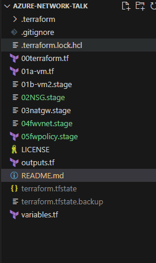
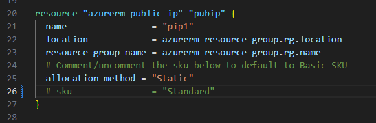
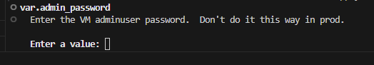

## Introduction
This repo is the work in progress for an upcoming talk covering basic aspects of Azure networking and Terraform IaC.

The .tf files have been designed so that they can be, in effect, commented out by renaming the .tf extension leaving a working repo that will deploy with ```terraform apply```

The prerequesites to installing are an Azure account and installed Terraform.

---
**_NB:_** The resources deployed **_will_** incur Azure costs.  No responsibility is accepted for bill shock.  Remember to ```terraform destroy``` if using this repo for test, learning or demo.

---
## TLDR
The talk consists of a series of live deployments to an Azure resource group.  There's a detailed walkthrough (coming!) below.  What will be covered:
* VM Internet access and how this changes depending on whether public IPs, Azure Route Tables and/or NAT Gateways are deployed.
* Default access and how Basic and Standard SKUs Azure Public IP resources differ (with a default open gotcha).
* Adding and changing NSGs.
* Use of NAT Gateway.
* Use of Azure Route Tables and Azure Firewall.

## Walkthrough
The Terraform code is designed to allow the deployment to evolve by deploying the .tf files in sequence.  Terraform will read all the .tf files in a directory so that a given deployment can be in one large file or in separate ones, as we have here.  Firstly change the extension of all the numbered .tf files except ```00terraform.tf``` and ```01a-vm.tf```.  The repo should look like this:

<pre>
</br>
</pre>


Also, comment out the public IP SKU line in 01a-vm.tf:

<pre>
</br>
</pre>

if running this having just cloned the repo, remember to ```terraform init``` first.

Now, if we run ```terraform apply``` we will deploy an Ubuntu VM with a public IP address with SSH open to the world.  This is because with Azure public IP resource will (at the time of writing in January 2024) default to the Basic SKU which is defaults to world open.

Note that the password for the virtual machine(s) is configured as a variable in variables.tf without a default value, so we will be prompted for a password with each ```terraform plan``` or ```terraform apply``` that we run.

<pre>
</br>
</pre>

