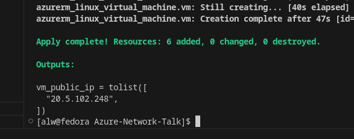
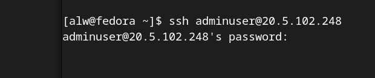
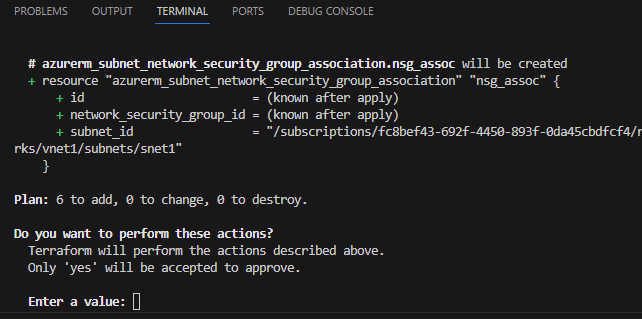

## Introduction
This repo is the work in progress for an upcoming talk covering basic aspects of Azure networking and Terraform IaC.

The .tf files have been designed so that they can be, in effect, commented out by renaming the .tf extension leaving a working repo that will deploy with ```terraform apply```

The prerequesites to installing are an Azure account and installed Terraform.

---
**_NB:_** The resources deployed **_will_** incur Azure costs.  No responsibility is accepted for bill shock.  Remember to ```terraform destroy``` if using this repo for test, learning or demo.

---
## TLDR
The talk consists of a series of live deployments to an Azure resource group.  There's a detailed walkthrough (coming!) below.  What will be covered:
* VM Internet access and how this changes depending on whether public IPs, Azure Route Tables and/or NAT Gateways are deployed.
* Default access and how Basic and Standard SKUs Azure Public IP resources differ (with a default open gotcha).
* Adding and changing NSGs.
* Use of NAT Gateway.
* Use of Azure Route Tables and Azure Firewall.

## Walkthrough 1 - beware defaults
The Terraform code is designed to allow the deployment to evolve by deploying the .tf files in sequence.  Terraform will read all the .tf files in a directory so that a given deployment can be in one large file or in separate ones, as we have here.  Firstly change the extension of all the numbered .tf files except ```00terraform.tf``` and ```01a-vm.tf```.  The repo should look like this:

<pre>
</br>
</pre>


Also, comment out the public IP SKU line in 01a-vm.tf:

<pre>
</br>
</pre>

if running this having just cloned the repo, remember to ```terraform init``` first.

Now, if we run ```terraform apply``` we will deploy an Ubuntu VM with a public IP address with SSH open to the world.  This is because with Azure public IP resource will (at the time of writing in January 2024) default to the Basic SKU which is defaults to world open.

Note that the password for the virtual machine(s) is configured as a variable in variables.tf without a default value, so we will be prompted for a password with each ```terraform plan``` or ```terraform apply``` that we run.

<pre>
</br>
</pre>

After running ```terraform apply``` the Ubuntu VM's public IP address will be presented as a terraform output:

<pre>
</br>
</pre>

This address will change with every deployment that results in a new VM.  Use it to ssh to the VM:

<pre>
</br>
</pre>

Note that there is no IP address restriction in accessing ssh.  It is open to the world.  If we now change the SKU of the Azure Public IP address to "Standard" by uncommenting the ```sku = "Standard"``` line in ```01a-vm.tf``` and re-run ```terraform apply``` we will get an error that the public IP address is still allocated and cannot be destroyed.  For the purposes of simplicity in a non-prod demo we can cheat a bit.  We'll run terraform destroy, followed by apply.  Now an attempt to connect SSH will time out.  This is because the we now have a Standard SKU Azure Public IP address which, unlike the basic SKU defaults closed.  We can view this with ```terraform state show 'azurerm_public_ip.pubip'```

---
## Walkthrough 2 - NSGs and Internet access
At the moment we have deployed an Ubuntu VM with no inbound (public) connectivity.  In a production environment, we'd probably use Azure Bastion rather than present port 22 to the outside world.  For the purposes of demo, we'll add a Network Security Group to allow access through our Standard SKU public IP and and a second VM without a public IP address to illustrate how Azure VMs connect to the Internet.

To do this, rename the ```01b-vm2``` and ```02NSG``` files so that their extensions are ```.tf```

<pre>
</br>
</pre>

Terraform will destroy/recreate a VM if the admin password is changed from the current state.  This doesn't really matter in our demo environment, but we'll enter the same admin password with ```terraform apply``` so we can show we are only adding to our deployment at this stage.

<pre>
</br>
</pre>

Next
Remember NSG allow variable
terraform state show 'azurerm_network_interface.vnic2'
curl ifconfig.me
