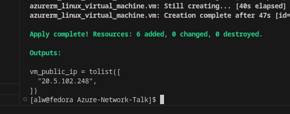

## Walkthrough 1 - beware defaults
The Terraform code is designed to allow the deployment to evolve by deploying the .tf files in sequence.  Terraform will read all the .tf files in a directory so that a given deployment can be in one large file or in separate ones, as we have here.  Firstly change the extension of all the numbered .tf files except ```00terraform.tf``` and ```01a-vm.tf```.  The repo should look like this:

<pre>
</br>
</pre>


Also, comment out the public IP SKU line in 01a-vm.tf:

<pre>
</br>
</pre>

if running this having just cloned the repo, remember to ```terraform init``` first.

Now, if we run ```terraform apply``` we will deploy an Ubuntu VM with a public IP address with SSH open to the world.  This is because with Azure public IP resource will (at the time of writing in January 2024) default to the Basic SKU which is defaults to world open.

Note that the password for the virtual machine(s) is configured as a variable in variables.tf without a default value, so we will be prompted for a password with each ```terraform plan``` or ```terraform apply``` that we run.

<pre>
</br>
</pre>

After running ```terraform apply``` the Ubuntu VM's public IP address will be presented as a terraform output:

<pre>
</br>
</pre>

This address will change with every deployment that results in a new VM.  Use it to ssh to the VM:

<pre>
</br>
</pre>

Note that there is no IP address restriction in accessing ssh.  It is open to the world.  If we now change the SKU of the Azure Public IP address to "Standard" by uncommenting the ```sku = "Standard"``` line in ```01a-vm.tf``` and re-run ```terraform apply``` we will get an error that the public IP address is still allocated and cannot be destroyed.  For the purposes of simplicity in a non-prod demo we can cheat a bit.  We'll run terraform destroy, followed by apply.  Now an attempt to connect SSH will time out.  This is because the we now have a Standard SKU Azure Public IP address which, unlike the basic SKU defaults closed.  We can view this with ```terraform state show 'azurerm_public_ip.pubip'```

