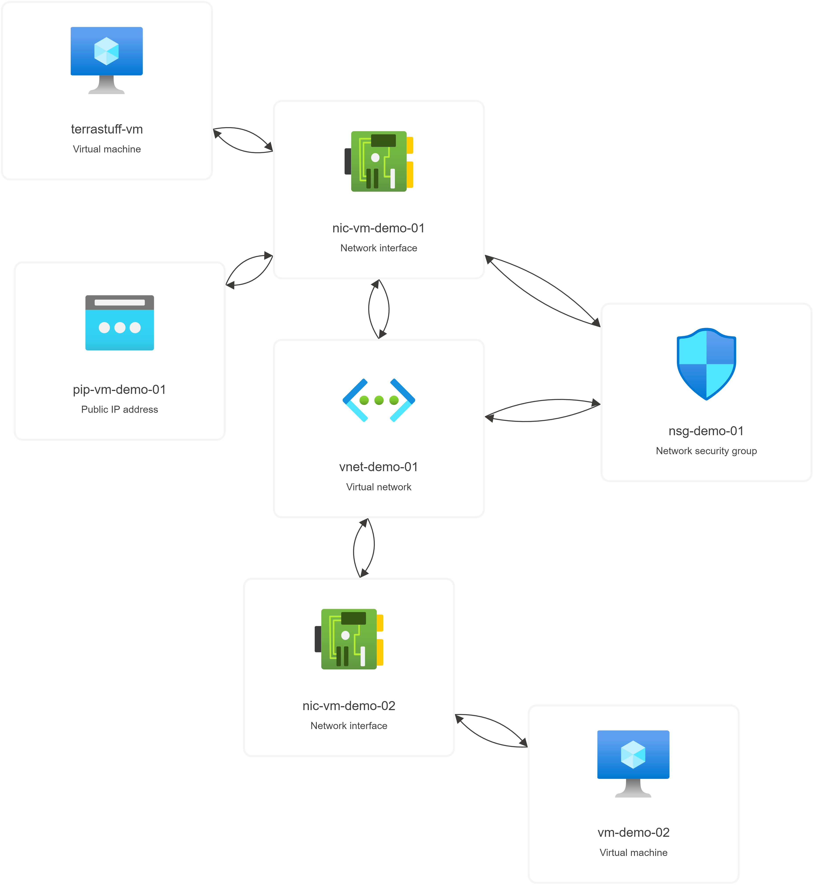

## Walkthrough 2 - NSGs and Internet access
What additional resources we are deploying:

<pre>
</br>
</pre>
---

At the moment we have deployed an Ubuntu VM with no inbound (public) connectivity.  In a production environment, we'd probably use Azure Bastion rather than present port 22 to the outside world.  For the purposes of demo, we'll add a Network Security Group to allow access through our Standard SKU public IP and and a second VM without a public IP address to illustrate how Azure VMs connect to the Internet.

To do this, rename the ```01b-vm2``` and ```02NSG``` files so that their extensions are ```.tf```

<pre>
</br>
</pre>

Also, we do want to improve on our world open SSH deployment!  The Terraform we are about to deploy includes a variable ```where_we_are_at```.  We'll edit this in ```variables.tf``` to our current IP address.

<pre>
</br>
</pre>
Terraform will destroy/recreate a VM if the admin password is changed from the current state.  This doesn't really matter in our demo environment, but we'll enter the same admin password with ```terraform apply``` so we can show we are only adding to our deployment at this stage.

<pre>
</br>
</pre>

After the deployment has completed we can now SSH to our VM.  This because we have deployed an NSG and associated it with both the VM subnet and the VM NIC with its bound public IP and explicitly allowed port 22.

Let's look at Azure VMs accessing the Internet.  SSH into our deployed VM using the public IP address output the the Terraform deployment.  Run ```curl ifconfig.me``` in the SSH session.  This will show our public IP address is the one the VM was deployed with.

<pre>
</br>
</pre>

What about, if we do not have an attached public IP address?  In the last deployment, we configured a second VM that does not have a bound public IP.  We could look in the Azure portal for its private IP address, but we're working in Terraform so type ```terraform state show 'azurerm_network_interface.vnic2'```.  Our ```private_ip_address``` is listed.  SSH to this host from the other VM.  If we run ```curl ifconfig.me``` again we will see a different IP address than the first VM.  This is because, without a public IP address or other explicitly configured Internet connectivity an Azure VM will make use of an implicit NAT.

<pre>
</br>
</pre>

<pre>
</br>
</pre>

 

