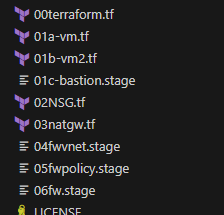

## Walkthrough  - Internet access through a NAT Gateway

Let's take a not too deep dive into what Azure NAT Gateway does.  Again, we'll add to our Terraform build by renaming a file.  This time change the extension of ```03natgw``` to ```.tf```

<pre>
</br>
</pre>

```terraform apply``` will tell us that an additional four resources will be deployed:

<pre>
</br>
</pre>

Instead of saying yes here, let's pause and take a look at what we are going to deploy, type ```no``` in the terraform confirmation prompt.  Instead run
```terraform plan -out "tfplan"```

BASH here: https://developer.hashicorp.com/terraform/tutorials/cli/plan

Powershell to work with later:
```
terraform show -json ".\tfplan" > output.json
$planObj = Get-Content ".\output.json" | ConvertFrom-Json
$planObj | Get-Member 
$planObj.resource_changes
$planObj.variables
```