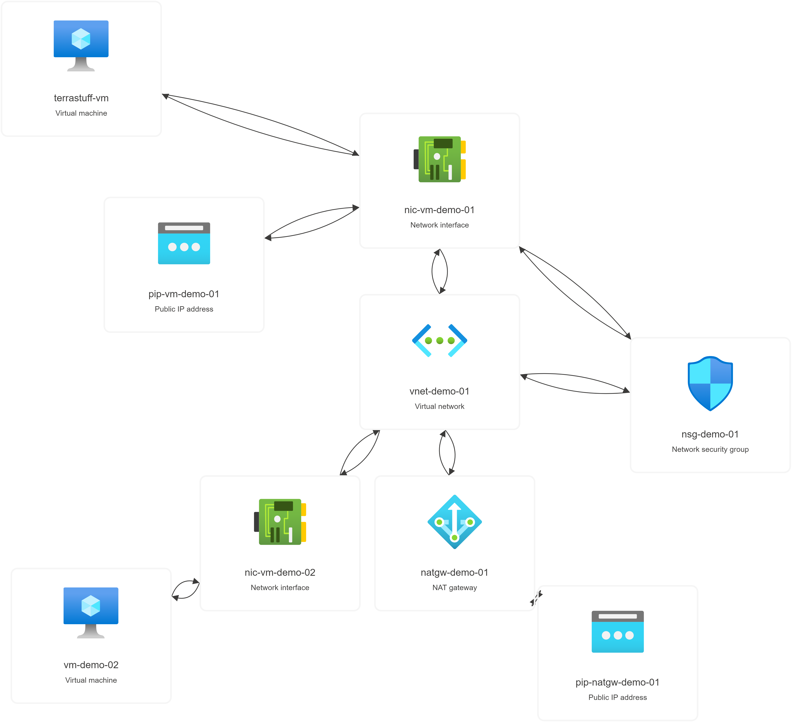
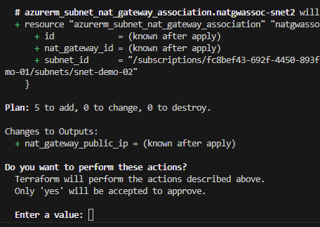
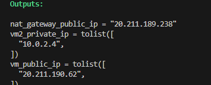
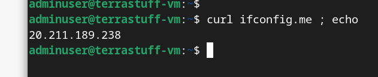
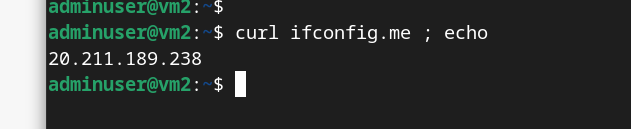
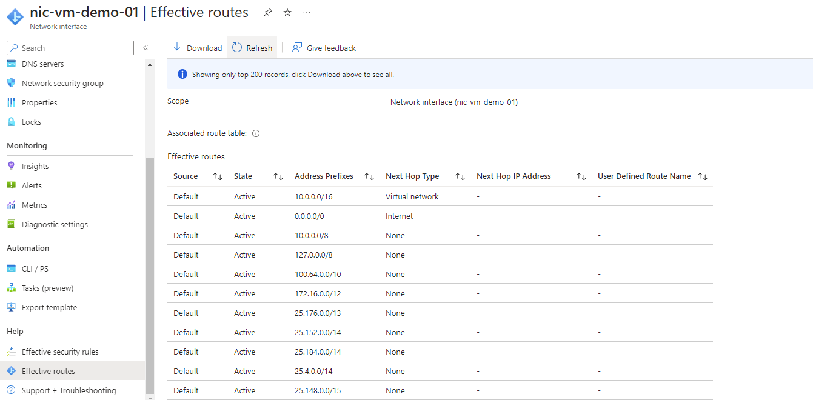

## Walkthrough  - Internet access through a NAT Gateway
What we're going to deploy:

<pre>
</br>
</pre>

Let's take a not too deep dive into what Azure NAT Gateway does.  Again, we'll add to our Terraform build by renaming a file.  This time change the extension of ```03natgw``` to ```.tf```

<pre>
</br>
</pre>

```terraform apply``` will tell us that an additional five resources will be deployed:

<pre>
</br>
</pre>

Instead of saying yes here, let's pause and take a look at what we are going to deploy, type ```no``` in the terraform confirmation prompt.  Instead run
```terraform plan -out "tfplan"```

If we now type ```terraform show ".\tfplan"``` we'll get output showing our four new resources:

<pre>
</br>
</pre>

There is a Hashicorp tutorial listing how to save a tfplan file in JSON format and query that file here: https://developer.hashicorp.com/terraform/tutorials/cli/plan.  

Also, in that tutorial:

<pre>
</br>
</pre>

So, whilst there is much we can do with a Terraform plan file, at this point we'll delete it before an inadvertant commits and carry on with ```terraform apply```

Next

<pre>
</br>
</pre>

SSH to both VMs and show ifconfig.me

<pre>
</br>
</pre>

<pre>
</br>
</pre>

If we look at the effective routes blade for the VM NICs:
<pre>
</br>
</pre>

There isn't actually anything to see here.  But, that is important.  We don't see a change in effective routes after deploying NAT Gateway.