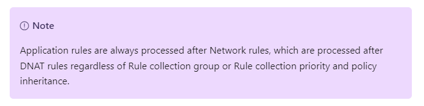
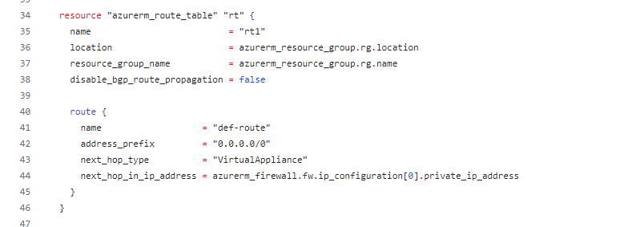
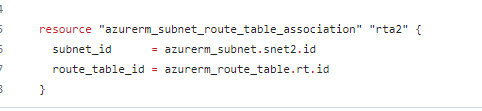
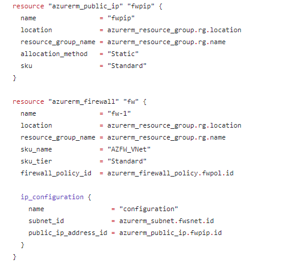

## Walkthrough  - Internet access through an Azure Firewall VM access through Azure Bastion
What we're going to deploy:
<pre>
</br>
</pre>
---
Here we are going to deploy an Azure Firewall and route our VM's Internet traffic through it.  To do this we have to deploy a number of other resources.  Let's have a quick run through of these before we run ```terraform apply```.  Firstly we are going to remove our NAT Gateway.  Not because it doesn't work with Azure Firewall - they absolutely can be integrated.  This is very useful in scenarios where port exhaustion could be a thing.  We will apply a route table and send Internet traffic out via Azure Firewall.

We're jumping ahead of ourselves a bit, we'll come back to Azure User Defined Routing.  First of all we need to deploy Azure Firewall into a subnet in a virtual network.  This could be in our exiting "vnet-demo-01" that we've been using since the very first virtual machine was spun up.  We'll create a new virtual network.  This is the arrangement that would be utilised in a hub and spoke topology.  We only have one "spoke" but, conceptually, this works in the same way to communicate with Azure Firewall and the Internet.

If we look at the resources deployed by ```04fwvnet.tf``` we can see a new virtual network with a single subnet named ```AzureFirewallSubnet```.  Azure Firewalls _must_ be configured within a subnet with this name.

<pre>
</br>
</pre>

By default, resources in different virtual networks cannot communicate with each other.  To allow this we have to configure _peering_.  We can see this looking at the remainder of the ```04fwvnet.tf``` file.

<pre>
</br>
</pre>

Rather than configure a Firewall DNAT rule to allow our SSH access to the deployed hosts, we'll make use of Azure Bastion.  Azure Bastion is what it sounds like: a managed platform service that provides RDP and SSH access to virtual machines directly through the Azure Portal, eliminating the need for public IP addresses or VPNs.

Now that we've mentioned firewall rules, we're nearly ready to talk about them. Azure Firewall has three SKUs - Basic, Standard and Premium.  We are going to deploy using the Standard SKU.  With earlier versions of Azure Firewall it was necessary to configure rules as part of the device set up. This can still be utilised for the basic SKU, however, now it is recommended to use a separate Azure resource - Firewall Policy.

This being a how it fits together talk, rather than a deep dive into Azure Firewall Policies we are deploying a very simple policy in ```05fwpolicy.tf```.  Firewall policies can be applied to more than one Azure Firewall.  There is an additional cost in doing this.  They can be hierarchical, one policy can inherit settings from another.  Within a single Firewall Policy there is a hierarchical structure to rules which are organised into Rule Collection Groups, then Rule Collections which contain the actual rules.  Rule Collections and Rule Collection Groups are assigned a priority between 100 (hightest) and 65,000 (lowest).

There are three rule types:  Application, Network and DNAT*.  The processing order of rule types takes precedence over assigned priority.

<pre>
</br>
</pre>
(https://learn.microsoft.com/en-us/azure/firewall/rule-processing)

*Where we said "three rule types" - the premium SKU also has threat intelligence based filtering.  What it sounds like.

OK, we have a firewall policy.  We don't have an actual firewall yet or, equally importantly, anything that will tell our VMs (or other resources) to route their traffic via Azure Firewall.  Both of these are defined in ```06fw.tf'''.  Looking at the Terraform for our route table:

<pre>
</br>
</pre>

We've only defined one route for our demo.  In a read example there are going to be routes to connect different spokes of a hub and spoke network together.  Note that we've defined the next hop of a default gateway route to be '''azurerm_firewall.fw.ip_configuration[0].private_ip_address''' - ie whatever the private IP address of the Azure Firewall.  It is important to note that a route table is a separate resource on Azure that is then "associated" with subnets to override default routing:

<pre>
</br>
</pre>

And after all of that, our Azure Firewall is quite simple:

<pre>
</br>
</pre>
