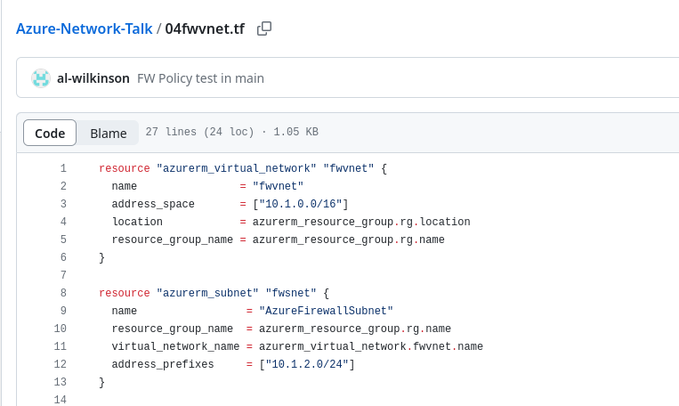
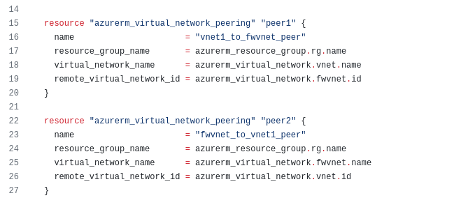

## Walkthrough  - Internet access through an Azure Firewall VM access through Azure Bastion
What we're going to deploy:
<pre>
</br>
</pre>
---
Here we are going to deploy an Azure Firewall and route our VM's Internet traffic through it.  To do this we have to deploy a number of other resources.  Let's have a quick run through of these before we run ```terraform apply```.  Firstly we are going to remove our NAT Gateway.  Not because it doesn't work with Azure Firewall - they absolutely can be integrated.  This is very useful in scenarios where port exhaustion could be a thing.  We will apply a route table and send Internet traffic out via Azure Firewall.

We're jumping ahead of ourselves a bit, we'll come back to Azure User Defined Routing.  First of all we need to deploy Azure Firewall into a subnet in a virtual network.  This could be in our exiting "vnet-demo-01" that we've been using since the very first virtual machine was spun up.  We'll create a new virtual network.  This is the arrangement that would be utilised in a hub and spoke topology.  We only have one "spoke" but, conceptually, this works in the same way to communicate with Azure Firewall and the Internet.

If we look at the resources deployed by ```04fwvnet.tf``` we can see a new virtual network with a single subnet named ```AzureFirewallSubnet```.  Azure Firewalls _must_ be configured within a subnet with this name.

<pre>
</br>
</pre>

By default, resources in different virtual networks cannot communicate with each other.  To allow this we have to configure _peering_.  We can see this looking at the remainder of the ```04fwvnet.tf``` file.

<pre>
</br>
</pre>

Rather than configure a Firewall DNAT rule to allow our SSH access to the deployed hosts, we'll make use of Azure Bastion.  Azure Bastion is what it sounds like: a managed platform service that provides RDP and SSH access to virtual machines directly through the Azure Portal, eliminating the need for public IP addresses or VPNs.

Now that we've mentioned firewall rules, we're nearly ready to talk about them.

Azure Firewall has three SKUs - Basic, Standard and Premium.  We are going to deploy using the Standard SKU.  With earlier versions of Azure Firewall it was necessary to configure rules as part of the device set up.  Now, it is recommended to use a separate Azure resource - Firewall Policy.


Concepts
Azure Firewall summary + link
Azure Firewall rules can be applied directly to the firewall, or they can be configured as a separate resource - Azure Firewall Policy.  Firewall Policy resources allow rules to be applied to multiple firewalls, but do have an associated cost.

Rule Collection Groups, Rule Collections and Rules
https://learn.microsoft.com/en-us/azure/firewall/rule-processing

We also need other resources:  Azure Firewalls have to be deployed into a subnet named "AzureFirewallSubnet".  This could be in our existing virtual network, but it is more common to place connectivity devices, such as Azure Firewall in a spoke virtual network of a hub and spoke topology.  So, we will also create a new virtual network to contain the "AzureFirewallSubnet".

In Azure, communication between subnets in the same Virtual Network is in place by default.  Communication between different virtual networks requires "peering", so we must also create this peering.


Our VMs, as well as any other resources we deploy into virtual networks, need routes configured to direct traffic to the Azure Firewall.  In Azure this is done by configuring a Route Table resource and attaching it to required subnets.

